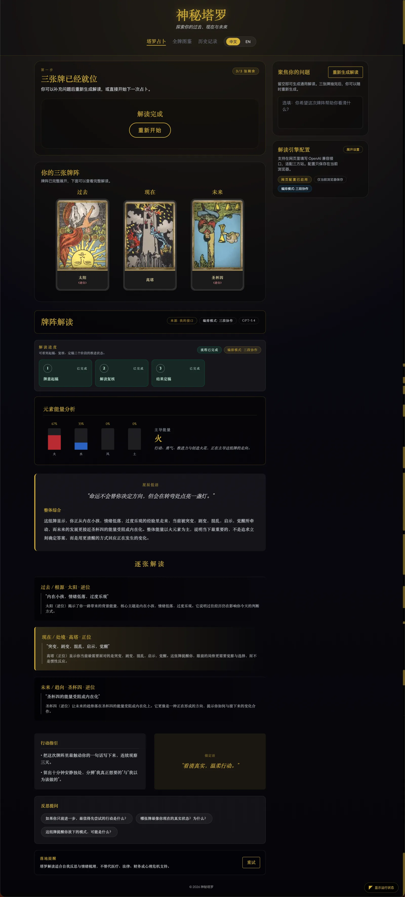

# Mystic Tarot

> Live demo: `https://tarot.hypoy.cn`  
> English documentation / [查看中文文档](./README.md)

A modern Tarot reading app built with `React` + `Vite`, featuring bilingual card data, structured AI interpretations, browser-based AI configuration, and a lightweight multi-agent backend with real-time `SSE` updates.

## Preview



> This overview image shows the overall UI style across the draw flow, reading view, right-side engine settings, gallery, history, and runtime entry.

## Overview

Mystic Tarot is designed to make the full reading pipeline visible and trustworthy instead of simply generating a vague mystical paragraph.

- The frontend supports card drawing, spread display, history, and bilingual UI.
- The backend hydrates incoming card `id`s into full tarot context before sending them to AI.
- The app supports both official `OpenAI` endpoints and `OpenAI-compatible` third-party providers.
- It supports `single` mode and `multi` three-stage orchestration.
- The reading flow is streamed via `SSE` with `meta / phase / partial / complete / error` events.
- Failures, overloads, and fallbacks are shown explicitly instead of being hidden behind fake success states.

## Highlights

- Full `78-card` tarot dataset with Chinese and English localization.
- Three-card timeline spread: `Past / Present / Future`.
- Structured reading output: `summary / quote / perCard / advice / followUps / mantra / safetyNote`.
- In-browser AI settings: `Base URL / API Key / Model / Provider Label / Orchestration`.
- Compatible with third-party OpenAI-style providers.
- Three-stage pipeline: `Card draft / Reading review / Final reading`.
- Real-time progress timeline and stage logs.
- Local history with preview thumbnails.
- Automatic fallback to server or local reading when AI is unavailable.

## Quick Start

1. Install dependencies:

   ```bash
   npm install
   ```

2. Start the frontend:

   ```bash
   npm run dev
   ```

3. In another terminal, start the API server:

   ```bash
   npm run dev:api
   ```

4. Open:

   ```text
   http://localhost:5173
   ```

5. Build for production:

   ```bash
   npm run build
   ```

## Environment Variables

See `.env.example` for the complete template.

| Variable | Default | Description |
| --- | --- | --- |
| `OPENAI_API_KEY` | empty | Default server-side API key |
| `OPENAI_MODEL` | `gpt-5-mini` | Default model |
| `OPENAI_BASE_URL` | `https://api.openai.com/v1` | Official or compatible base URL |
| `AI_PROVIDER` | `auto` | `auto / openai / mock` |
| `AI_ORCHESTRATION` | `multi` | Default orchestration mode |
| `PORT` | `8787` | Local API port |
| `CORS_ORIGIN` | `http://localhost:5173` | Allowed browser origin |
| `VITE_API_BASE_URL` | empty | Optional API URL for separate frontend deployment |
| `OPENAI_REQUEST_TIMEOUT_MS` | `90000` | Server-side non-stream timeout |
| `OPENAI_STREAM_TIMEOUT_MS` | `180000` | Server-side streaming timeout |
| `VITE_STREAM_TIMEOUT_MS` | `180000` | Frontend SSE timeout |

## Browser AI Settings

The right-side settings panel allows users to:

- enable or disable browser-side AI overrides,
- set `Base URL / API Key / Model` for third-party providers,
- set a custom provider display name,
- choose `single` or `multi` orchestration per browser,
- keep all settings in `localStorage` only.

Priority order:

1. Browser settings
2. Server environment variables
3. `mock` fallback

## Runtime Modes

### `mock`

Used when no valid API key is available or when `AI_PROVIDER=mock` is forced.

### `single`

Generates one full structured reading directly with lower latency and lower token cost.

### `multi`

Runs three independent stages:

- `DraftAgent`: Card draft
- `ReviewAgent`: Reading review
- `FinalizeAgent`: Final reading

## Real SSE Flow

Endpoint:

```text
POST /api/reading/stream
```

Events:

- `meta`
- `phase`
- `partial`
- `complete`
- `error`

Typical `multi` flow:

```text
meta
phase draft:started
phase draft:completed
partial stage=draft
phase review:started
phase review:completed
partial stage=review
phase finalize:started
partial stage=finalize ...
phase finalize:completed
complete
```

Notes:

- `draft` and `review` partials are snapshots, not the final answer.
- `finalize` prefers native provider streaming.
- If native streaming is not supported, the app falls back to buffered finalize output.

## Fallback Behavior

If remote AI fails, times out, or is overloaded:

- the backend emits the exact failed stage,
- the frontend shows the failure reason,
- `multi` falls back to `single`,
- `single` falls back to `mock`,
- frontend stream failure can fall back to `local-fallback`.

## License

This project is currently released under the `Apache-2.0` License. See `LICENSE` for details, and `NOTICE` for attribution information.

## Architecture

See the Chinese README for the full Mermaid architecture and sequence diagrams:

- [中文架构文档](./README.md)
- [View LICENSE](./LICENSE)
- [View NOTICE](./NOTICE)
