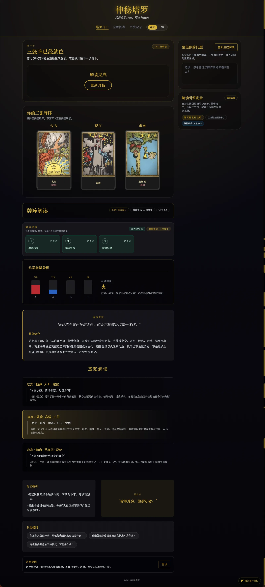
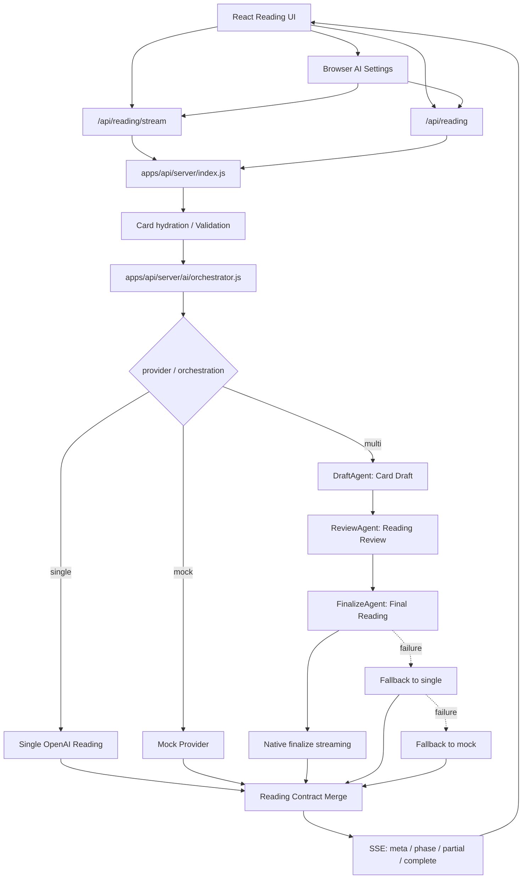
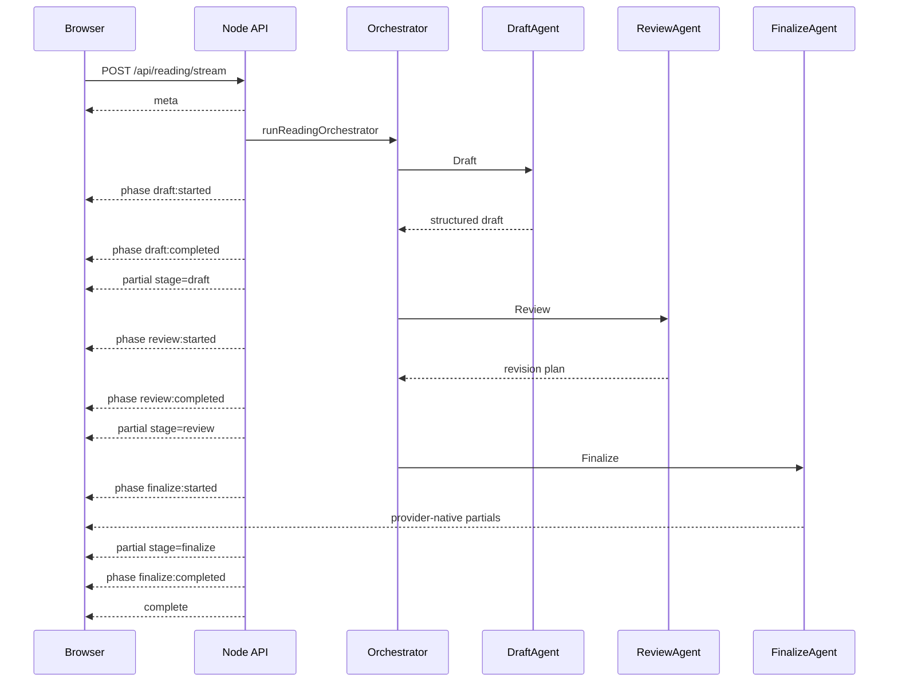

# Mystic Tarot

> Live: [tarot.hypoy.cn](https://tarot.hypoy.cn)　|　[中文文档](./README.md)

A modern Tarot reading app built with `React` + `Vite`, featuring bilingual card data, structured AI interpretations, in-browser model configuration, and a lightweight multi-agent backend with real-time `SSE` progress streaming.


## Preview



> The overall UI across the draw flow, reading view, engine settings panel, card gallery, history, and runtime status entry.

## Overview

Mystic Tarot is designed to make the full reading pipeline transparent and verifiable — not just a vague mystical paragraph:

- **Frontend**: card drawing, spread display, history, and bilingual Chinese/English UI.
- **Backend**: hydrates card `id`s into full tarot context, then streams `meta / phase / partial / complete / error` events via `SSE`.
- Works with both official `OpenAI` endpoints and any `OpenAI-compatible` third-party provider.
- Two orchestration modes: `single` (one-shot) and `multi` (three-stage pipeline).
- Failures, timeouts, and overloads are shown explicitly — no silent degradation disguised as success.

## Highlights

- **Full 78-card tarot dataset** in Chinese and English, with search, grouping, sorting, favorites, and side-by-side comparison.
- **Three-card timeline spread**: Past / Present / Future, featuring spring-based card fly-in and micro-rebound animation via Framer Motion.
- **Mystical Aesthetics & Glassmorphism**: Elegant cosmic background with rotating nebulae (Stellar Glow) and fine dark gold borders with glow shadows on all panels.
- **Tabbed Card Deck Reading**: Restructured vertical long scrolls into an interactive "Past / Present / Future" tabbed view with upright/reversed badges.
- **Divination Loading Ceremony**: Double celestial orbits spinning concurrently with custom pulsing element bar skeletons to minimize loading anxiety.
- **Structured output**: `summary / quote / perCard / advice / followUps / mantra / safetyNote`.
- **In-browser AI settings**: `Base URL / API Key / Model / Provider Label / Orchestration`, stored only in `localStorage`.
- **Three-stage pipeline**: Card Draft → Reading Review → Final Reading, with native provider streaming in the final stage.
- **Real-time progress timeline**: SSE pushes phase changes and partial snapshots — no more guessing when results arrive.
- **Multi-level fallback**: multi fails → single → mock → local fallback, ensuring the page never deadlocks.

## Card Gallery

The gallery is designed as a long-term reference workspace, not just a 78-card wall:

- Search and filter by `name / arcana / suit / element`, with `grid` and `grouped` views.
- Five sort modes: `by suit / by name / by element / favorites first / by id`.
- Quick jump to Major Arcana, Wands, Cups, Swords, Pentacles.
- Favorites + recently viewed + up to 3 cards side-by-side comparison.
- Keyboard navigation in detail modal (`← → / Esc`), collapsible filter toolbar on mobile.

## Tech Stack

| Layer | Technology |
| --- | --- |
| Frontend | `React 19` · `Vite 5` |
| Styling | `Tailwind CSS v4` |
| Animation | `Framer Motion` |
| Backend | Native `Node.js http server` |
| AI Protocol | `OpenAI Responses API` · `OpenAI-compatible chat/completions` |
| Real-time | `SSE (text/event-stream)` |

## Quick Start

```bash
# Install dependencies
npm install

# Start the frontend
npm run dev

# In another terminal, start the API server
npm run dev:api

# Build for production
npm run build
```

Open `http://localhost:5173`.

## Environment Variables

See `.env.example` for the complete template.

| Variable | Default | Description |
| --- | --- | --- |
| `OPENAI_API_KEY` | empty | Default server-side API key |
| `OPENAI_MODEL` | `gpt-5-mini` | Default model |
| `OPENAI_BASE_URL` | `https://api.openai.com/v1` | Official or compatible base URL |
| `AI_PROVIDER` | `auto` | `auto / openai / mock` |
| `AI_ORCHESTRATION` | `multi` | Default orchestration: `multi / single` |
| `PORT` | `8787` | Local API port |
| `CORS_ORIGIN` | `http://localhost:5173` | Allowed origin(s), comma-separated or `*` |
| `VITE_API_BASE_URL` | empty | API URL for separate frontend deployment; leave empty for same-origin `/api` |
| `VITE_BASE_PATH` | `/` | Frontend base path for deployment |
| `OPENAI_REQUEST_TIMEOUT_MS` | `90000` | Server non-stream timeout (ms) |
| `OPENAI_STREAM_TIMEOUT_MS` | `180000` | Server stream timeout (ms) |
| `VITE_STREAM_TIMEOUT_MS` | `180000` | Frontend SSE timeout (ms) |

## Production Deployment

**Single-server deployment** is supported: once `dist` exists, `apps/api/server/index.js` serves both the frontend build and `/api` endpoints from the same process.

```bash
npm install
npm run build
npm run start
```

By default, frontend and API share the same origin and port — leave `VITE_API_BASE_URL` empty. For split deployments:

- Set `VITE_API_BASE_URL` when building the frontend
- Set `CORS_ORIGIN` on the backend

The codebase is now split into `apps/web` and `apps/api/server`. Root scripts delegate to the right app:

- `npm run dev` starts `apps/web`
- `npm run dev:api` starts `apps/api/server`
- `npm run build` builds the frontend into root `dist`

## Docker Deployment

The repo includes a root-level `Dockerfile` and `compose.yaml`.

### Build directly

```bash
docker build -t mystic-tarot .
docker run -d --name mystic-tarot -p 8787:8787 --env-file .env mystic-tarot
```

### Docker Compose

```bash
docker compose up -d --build
docker compose down   # stop
```

### Common scenarios

- Subpath deployment: set `VITE_BASE_PATH=/your-subpath/` before building
- Split frontend/backend: set `VITE_API_BASE_URL=https://api.example.com` before building
- Adjust stream timeout: set `VITE_STREAM_TIMEOUT_MS=240000` before building
- Runtime overrides: `OPENAI_API_KEY`, `OPENAI_MODEL`, `OPENAI_BASE_URL`, `AI_PROVIDER`, `AI_ORCHESTRATION`, `CORS_ORIGIN`

### Image characteristics

- Multi-stage build, production dependencies only
- Runs as non-root user
- Built-in `/health` endpoint
- `.dockerignore` excludes `.env`

## In-Browser AI Settings

The right-side settings panel allows:

- Enable / disable browser-side AI overrides.
- Configure `Base URL / API Key / Model` for third-party providers.
- Set a custom provider display name and per-browser orchestration mode.
- All settings stored in `localStorage` only — never written to disk or uploaded.

Priority: **browser settings > server environment variables > mock fallback**.

## Runtime Modes

### `mock`

When no valid API key is available or `AI_PROVIDER=mock` is forced, returns deterministic server-side mock readings with `orchestration` marked as `mock`.

### `single`

Generates a complete structured reading in one pass — lower latency, lower token cost, no three-stage review pipeline.

### `multi`

Three independent stages:

- **DraftAgent**: Card draft
- **ReviewAgent**: Reading review
- **FinalizeAgent**: Final reading (prefers native streaming)

## SSE Event Stream

```text
POST /api/reading/stream
```

Event types:

| Event | Meaning |
| --- | --- |
| `meta` | Actual provider and orchestration used |
| `phase` | Stage status change |
| `partial` | Partial content snapshot for a stage |
| `complete` | Final complete result |
| `error` | Stream-level error |

### `multi` mode event order

```text
meta
phase draft:started
phase draft:completed
partial stage=draft
phase review:started
phase review:completed
partial stage=review
phase finalize:started
partial stage=finalize ... (multiple)
phase finalize:completed
complete
```

Key notes:

- `draft` and `review` partials are stage snapshots, not the final result.
- `finalize` prefers native provider streaming — real, continuous output.
- If the third-party provider lacks native streaming support, it falls back to buffered finalize.

## Fallback Behavior

When the remote model fails, times out, or is overloaded:

- The backend emits the exact failed stage (`draft failed / review failed / finalize failed`).
- The frontend timeline shows the failure node and reason.
- Fallback chain: `multi → single → mock → local fallback`.

Example server log:

```text
[reading phase] draft:completed (custom-openai / gpt-5.2)
[reading phase] review:started
[reading phase] finalize:failed — system cpu overloaded
[reading phase] fallback:triggered — system cpu overloaded
```

## Architecture


```mermaid
flowchart TD
  UI[React Reading UI] --> SETTINGS[Browser AI Settings]
  UI --> STREAM["/api/reading/stream"]
  UI --> JSON["/api/reading"]

  SETTINGS --> STREAM
  SETTINGS --> JSON

  STREAM --> API["apps/api/server/index.js"]
  JSON --> API
  API --> HYDRATE[Card hydration / Validation]
  HYDRATE --> ORCH["apps/api/server/ai/orchestrator.js"]

  ORCH --> MODE{provider / orchestration}

  MODE -->|mock| MOCK[Mock Provider]
  MODE -->|single| SINGLE[Single OpenAI Reading]
  MODE -->|multi| DRAFT[DraftAgent: Card Draft]

  DRAFT --> REVIEW[ReviewAgent: Reading Review]
  REVIEW --> FINALIZE[FinalizeAgent: Final Reading]
  FINALIZE --> FINAL_STREAM[Native finalize streaming]

  FINALIZE -.failure.-> FALLBACK_SINGLE[Fallback to single]
  FALLBACK_SINGLE -.failure.-> FALLBACK_MOCK[Fallback to mock]

  SINGLE --> MERGE[Reading Contract Merge]
  MOCK --> MERGE
  FINAL_STREAM --> MERGE
  FALLBACK_SINGLE --> MERGE
  FALLBACK_MOCK --> MERGE

  MERGE --> SSE["SSE: meta / phase / partial / complete"]
  SSE --> UI
```

## Sequence Diagram


```mermaid
sequenceDiagram
  participant Browser
  participant API as Node API
  participant Orch as Orchestrator
  participant Draft as DraftAgent
  participant Review as ReviewAgent
  participant Finalize as FinalizeAgent

  Browser->>API: POST /api/reading/stream
  API-->>Browser: meta
  API->>Orch: runReadingOrchestrator

  Orch->>Draft: Draft
  API-->>Browser: phase draft:started
  Draft-->>Orch: structured draft
  API-->>Browser: phase draft:completed
  API-->>Browser: partial stage=draft

  Orch->>Review: Review
  API-->>Browser: phase review:started
  Review-->>Orch: revision plan
  API-->>Browser: phase review:completed
  API-->>Browser: partial stage=review

  Orch->>Finalize: Finalize
  API-->>Browser: phase finalize:started
  Finalize-->>Browser: provider-native partials
  API-->>Browser: partial stage=finalize
  API-->>Browser: phase finalize:completed
  API-->>Browser: complete
```

## Project Structure

```text
apps/
  web/
    src/             UI, card data, browser-side API wrappers
    public/          Static assets and card images
  api/
    server/          Fastify API, AI providers, agents, orchestrator, streaming
packages/
  shared/            Shared event contracts
```

## FAQ

### Connection test passes but the actual reading fails

Common causes: third-party providers may not fully support structured or streaming output; temporary model overload; stream timeout.

Try: switch to `single` mode first → verify the Base URL path → increase timeout values if needed.

### Why do I see `partial` events that aren't the final result?

`draft` and `review` partials are stage snapshots. Only the `finalize` stage and the final `complete` event contain the finished reading.

### Why does it fall back to mock or local?

This is intentional — a defense-in-depth fallback chain (multi → single → mock → local) ensures the page never hangs, regardless of where the failure occurs.

## License

`Apache-2.0`. See `LICENSE` and `NOTICE` for details.
