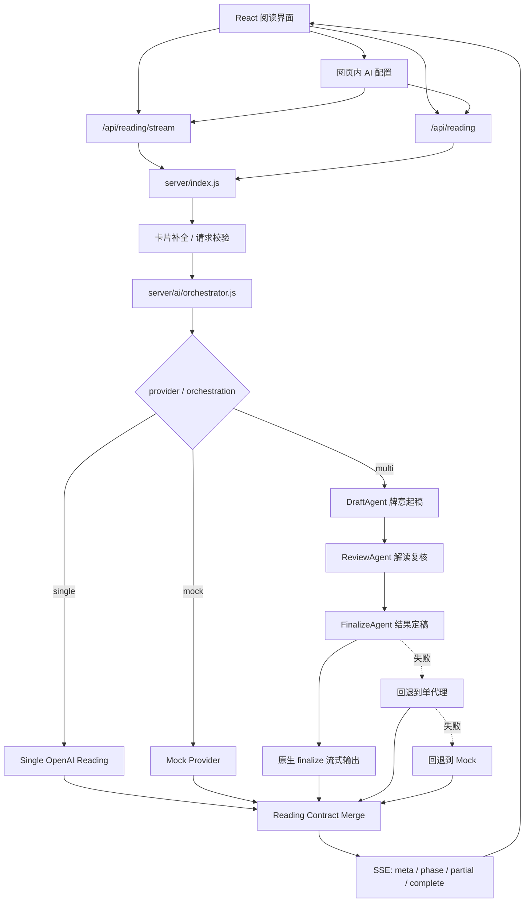
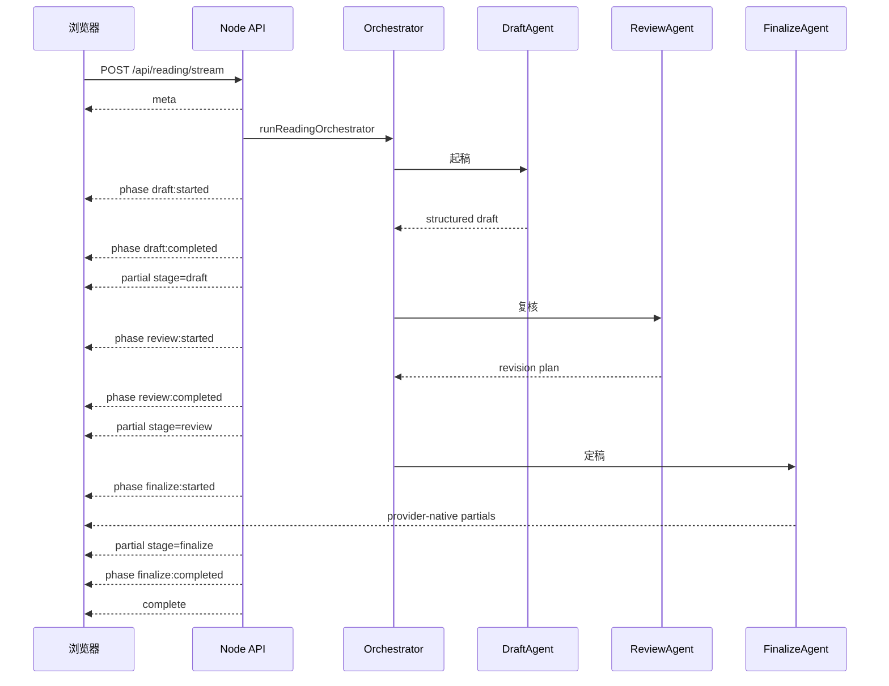

# Mystic Tarot · 神秘塔罗

> 在线体验：`https://tarot.hypoy.cn`  
> 中文文档 / [English README](./README.en.md)

一个基于 `React` + `Vite` 的现代塔罗应用，支持中英双语牌义、结构化 AI 解读、网页内 AI 配置，以及带有实时 `SSE` 进度反馈的轻量多 Agent 后端。

## 界面预览


> 这张总览图展示了首页抽牌、牌阵解读、右侧解读引擎配置、全牌图鉴、历史记录与右下角运行状态入口的整体界面风格。

## 项目概览

神秘塔罗不是“随机生成一段神秘文案”的玩具，而是尽量把以下几件事做清楚：

- 前端支持抽牌、牌阵展示、历史记录、双语切换。
- 后端会把前端上传的卡片 `id` 补全为完整牌义上下文，再交给 AI。
- 支持在网页里直接配置 `OpenAI` 官方接口或任意 `OpenAI-compatible` 第三方站点。
- 支持 `single` 单代理模式和 `multi` 三段协作模式。
- 解读过程通过 `SSE` 实时推送 `meta / phase / partial / complete / error` 事件。
- 当远端模型失败、超时或过载时，会明确显示失败阶段和回退原因，而不是“假装流程正常完成”。

## 功能亮点

- 完整 `78` 张塔罗牌数据，支持中文 / 英文展示。
- 三张时间线牌阵：`过去 / 现在 / 未来`。
- 结构化解读输出：`summary / quote / perCard / advice / followUps / mantra / safetyNote`。
- 网页内 AI 配置：`Base URL / API Key / Model / 提供方显示名 / 编排模式`。
- 兼容第三方 OpenAI 站点，可自定义来源显示名。
- 三段协作编排：`牌意起稿 / 解读复核 / 结果定稿`。
- 实时进度条与阶段日志，不再依赖前端猜测流程。
- 支持本地历史记录与缩略预览。
- 当 AI 不可用时自动回退到本地或服务端兜底结果。

## 技术栈

- 前端：`React 19`、`Vite 5`
- 样式：`Tailwind CSS v4`
- 动画：`Framer Motion`
- 后端：原生 `Node.js http server`
- AI 协议：`OpenAI Responses API`、`OpenAI-compatible chat/completions`
- 实时传输：`SSE (text/event-stream)`

## 快速开始

1. 安装依赖：

   ```bash
   npm install
   ```

2. 启动前端：

   ```bash
   npm run dev
   ```

3. 另开一个终端启动本地 API：

   ```bash
   npm run dev:api
   ```

4. 打开浏览器：

   ```text
   http://localhost:5173
   ```

5. 构建生产包：

   ```bash
   npm run build
   ```

## 环境变量

项目默认读取根目录的环境变量；示例可参考 `.env.example`。

| 变量名 | 默认值 | 说明 |
| --- | --- | --- |
| `OPENAI_API_KEY` | 空 | 服务端默认使用的 API Key |
| `OPENAI_MODEL` | `gpt-5-mini` | 服务端默认模型 |
| `OPENAI_BASE_URL` | `https://api.openai.com/v1` | 官方或兼容接口基地址 |
| `AI_PROVIDER` | `auto` | `auto / openai / mock` |
| `AI_ORCHESTRATION` | `multi` | 默认编排模式：`multi / single` |
| `PORT` | `8787` | 本地 API 端口 |
| `CORS_ORIGIN` | `http://localhost:5173` | 允许访问 API 的来源 |
| `VITE_API_BASE_URL` | 空 | 前端单独部署时可指定 API 地址；留空时默认走同源 `/api` |
| `VITE_BASE_PATH` | `/` | 前端部署根路径；默认适合根域名部署 |
| `OPENAI_REQUEST_TIMEOUT_MS` | `90000` | 服务端普通 AI 请求超时 |
| `OPENAI_STREAM_TIMEOUT_MS` | `180000` | 服务端流式 AI 请求超时 |
| `VITE_STREAM_TIMEOUT_MS` | `180000` | 前端等待 SSE 的超时 |

## 生产部署

现在支持 **单机一体部署**：构建完成后，`server/index.js` 会在存在 `dist` 时同时托管前端静态文件与 `/api` 接口。

最简生产流程：

```bash
npm install
npm run build
npm run start
```

默认情况下：

- 前端与 API 同域同端口
- 不再强制依赖额外的静态托管平台
- `VITE_API_BASE_URL` 留空即可

如果你仍然采用前后端分离部署：

- 前端构建时设置 `VITE_API_BASE_URL`
- 后端设置 `CORS_ORIGIN`，支持单个域名、多个域名（逗号分隔）或 `*`

## Docker 部署

项目已提供根目录 `Dockerfile` 与 `compose.yaml`，支持一体化镜像构建和单容器运行。

### 方式一：直接构建镜像

```bash
docker build -t mystic-tarot .
```

运行容器：

```bash
docker run -d --name mystic-tarot -p 8787:8787 --env-file .env mystic-tarot
```

### 方式二：使用 Docker Compose

如果根目录已有 `.env`：

```bash
docker compose up -d --build
```

停止服务：

```bash
docker compose down
```

### 常见场景

- 子路径部署：在构建前设置 `VITE_BASE_PATH=/your-subpath/`
- 前后端分离：在构建前设置 `VITE_API_BASE_URL=https://api.example.com`
- 需要调整前端流式超时：在构建前设置 `VITE_STREAM_TIMEOUT_MS=240000`
- 运行时可覆盖：`OPENAI_API_KEY`、`OPENAI_MODEL`、`OPENAI_BASE_URL`、`AI_PROVIDER`、`AI_ORCHESTRATION`、`CORS_ORIGIN`

### 当前镜像特性

- 使用多阶段构建，镜像内仅保留生产依赖
- 容器内以非 root 用户运行
- 内置 `/health` 健康检查，方便部署平台探活
- 仍由 Node 同时托管 `dist` 与 `/api`
- `.dockerignore` 已排除 `.env`，不会把本地密钥打进构建上下文

## 网页内 AI 配置

阅读页右侧的 AI 配置面板支持以下能力：

- 启用或关闭“网页内 AI 配置”。
- 填写 `Base URL / API Key / Model`，适配第三方兼容站点。
- 设置“提供方显示名”，例如：`DeepSeek`、`OpenRouter`、`我的接口`。
- 单独选择当前浏览器的编排模式：`single` 或 `multi`。
- 配置只保存在当前浏览器的 `localStorage` 中，不会写入仓库或服务器。

优先级如下：

1. 网页内用户配置
2. 服务端环境变量
3. 无可用远端配置时回退到 `mock`

## 运行模式

### `mock`

当没有可用 `OPENAI_API_KEY`，或服务端被强制设为 `AI_PROVIDER=mock` 时：

- 返回确定性的服务端模拟解读。
- `orchestration` 会标记为 `mock`。
- 不会伪装成三段流程。

### `single`

单代理模式会直接生成一份完整结构化解读：

- 延迟更低
- token 消耗更少
- 没有三阶段审稿链路

### `multi`

三段协作模式由三个独立 agent 完成：

- `DraftAgent`：牌意起稿
- `ReviewAgent`：解读复核
- `FinalizeAgent`：结果定稿

## 真实事件流（SSE）

流式接口为：

```text
POST /api/reading/stream
```

会向前端推送以下事件：

- `meta`：本次实际 provider 与 orchestration
- `phase`：阶段状态变化
- `partial`：阶段中的部分内容快照
- `complete`：最终完整结果
- `error`：流式接口错误

### `multi` 模式下的真实顺序

正常情况下，事件顺序是：

```text
meta
phase draft:started
phase draft:completed
partial stage=draft
phase review:started
phase review:completed
partial stage=review
phase finalize:started
partial stage=finalize ... (多次)
phase finalize:completed
complete
```

关键说明：

- `draft` 和 `review` 会推送“快照”，它们是阶段性成果，不代表最终定稿。
- `finalize` 优先走 **provider 原生流式**，也就是结果定稿阶段会真实持续输出，而不是事后假拆帧。
- 如果第三方站点不支持原生流式，系统会退回到 buffered finalize，再继续完成流程。

## 失败与回退机制

当远端模型失败、CPU 过载、无响应或超时时：

- 后端会发送明确的失败阶段，例如：
  - `draft failed`
  - `review failed`
  - `finalize failed`
- 前端时间线会展示失败节点与原因。
- 如果 `multi` 流程失败，会先尝试回退到单代理。
- 如果单代理也失败，最终回退到 `mock`。

终端日志大致会输出：

```text
[reading phase] draft:completed (custom-openai / gpt-5.2)
[reading phase] review:started
[reading phase] finalize:failed — system cpu overloaded
[reading phase] fallback:triggered — system cpu overloaded
```

## 架构图



## 时序图



## 项目结构

```text
src/
  components/        前端界面组件
  data/              塔罗牌数据
  lib/               前端逻辑、契约、存储、API 封装
  locales/           中英文本
server/
  ai/                provider、agents、orchestrator、streaming
  index.js           Node API 入口
```

## 常见问题

### 1. 连接测试成功，但正式解读失败

常见原因：

- 第三方兼容站点只兼容基础请求，不完全兼容结构化输出或流式输出。
- 模型临时过载，例如 `system_cpu_overloaded`。
- 流式链路超时，或第三方对长连接支持不稳定。

建议：

- 先切换到 `single` 模式验证基础可用性。
- 确认 `Base URL` 是否应指向 `/v1`、`/responses` 或 `/chat/completions`。
- 适当提高 `.env.example` 中的超时参数。

### 2. 为什么看到 `partial`，但内容还不是最终版？

因为：

- `draft` 和 `review` 的 `partial` 是阶段快照；
- 只有 `finalize` 阶段和最终 `complete` 才对应真正面向用户的定稿结果。

### 3. 为什么最终会回退到 `mock` 或本地解读？

这是故意设计的兜底策略，用来保证页面不会卡死：

- `multi` 失败 → 先回退 `single`
- `single` 再失败 → 回退 `mock`
- 前端流式异常 → 最后回退 `local-fallback`

## 开源协议

本项目当前采用 `Apache-2.0` 协议，详见 `LICENSE`。如需保留归属说明，请同时查看 `NOTICE`。

## English

英文文档已拆分到 `README.en.md`：

- [Open English README](./README.en.md)
- [查看 LICENSE](./LICENSE)
- [查看 NOTICE](./NOTICE)
