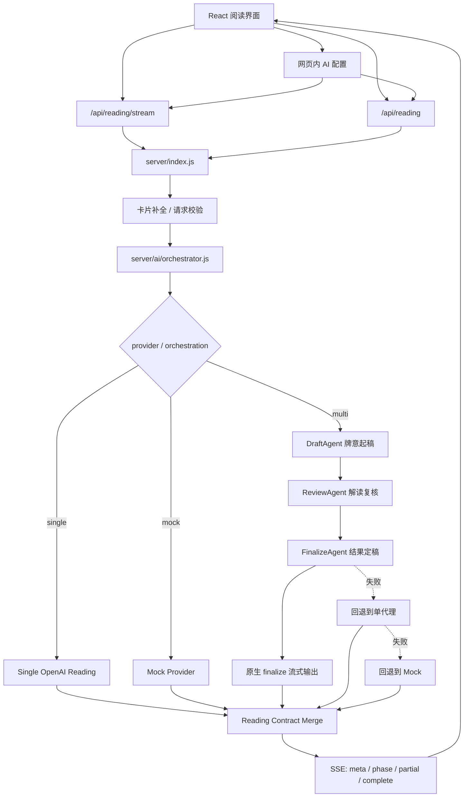
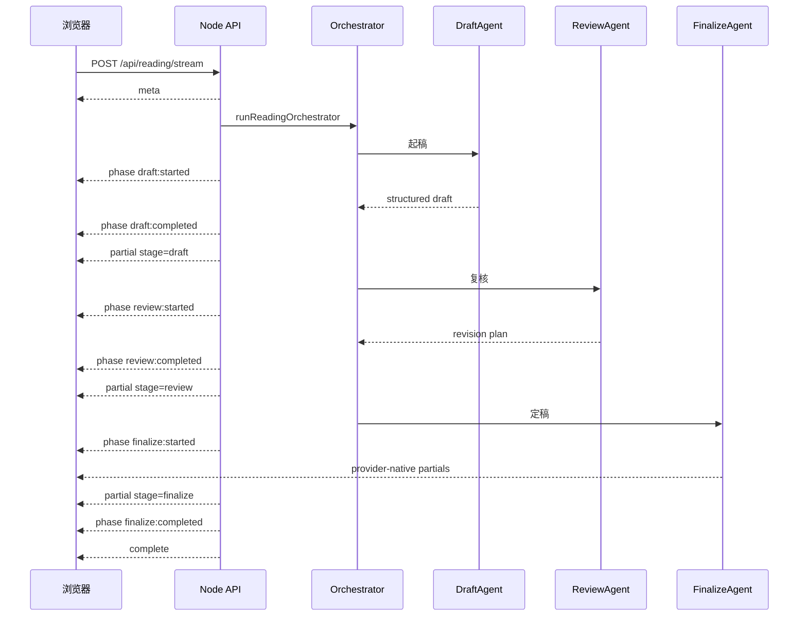

# Mystic Tarot · 神秘塔罗

> 在线体验：[tarot.hypoy.cn](https://tarot.hypoy.cn)　|　[English README](./README.en.md)

基于 `React` + `Vite` 的现代塔罗应用，集成双语牌义、结构化 AI 解读、网页内模型配置，以及带实时 `SSE` 进度反馈的轻量多 Agent 后端。


## 界面预览


> 首页抽牌、牌阵解读、右侧引擎配置、全牌图鉴、历史记录及运行状态入口的整体界面。

## 项目概览

神秘塔罗的设计目标是把解读链路做透明、可验证，而非生成一段模棱两可的神秘文案：

- 前端：抽牌、牌阵展示、历史记录、中英双语切换。
- 后端：接收卡片 `id`，补全牌义上下文后提交 AI，通过 `SSE` 实时推送 `meta / phase / partial / complete / error` 事件。
- 支持 `OpenAI` 官方接口及任意 `OpenAI-compatible` 第三方站点。
- 两种编排模式：`single`（单代理直出）与 `multi`（三段协作）。
- 远端模型失败、超时或过载时，明确展示失败阶段与回退原因，不做"假装成功"的静默降级。

## 功能亮点

- **78 张完整塔罗数据**，中英双语，支持搜索、分组、排序、收藏与并排对比。
- **三张时间线牌阵**：过去 / 现在 / 未来。
- **结构化解读输出**：`summary / quote / perCard / advice / followUps / mantra / safetyNote`。
- **网页内 AI 配置**：`Base URL / API Key / Model / 提供方显示名 / 编排模式`，配置仅存于浏览器 `localStorage`。
- **三段协作编排**：牌意起稿 → 解读复核 → 结果定稿，定稿阶段优先走 provider 原生流式。
- **实时进度与阶段日志**：SSE 推送阶段变化与部分快照，前端不再靠猜测等结果。
- **多级兜底**：multi 失败 → single → mock → 前端本地回退，保障页面不卡死。

## 全牌图鉴

图鉴设计定位为长期查阅的塔罗资料台，而非简单铺开 78 张牌：

- 按 `名称 / 牌组 / 花色 / 元素` 搜索与筛选，支持 `网格 / 分组` 两种视图。
- 五种排序：`按牌组 / 按名称 / 按元素 / 收藏优先 / 按编号`。
- 快速跳转至大阿卡那、权杖、圣杯、宝剑、星币分组。
- 收藏夹 + 最近查看 + 最多 3 张牌并排对比。
- 详情弹窗支持键盘操作（`← → / Esc`），移动端筛选栏折叠式设计。

## 技术栈

| 层 | 技术 |
| --- | --- |
| 前端框架 | `React 19` · `Vite 5` |
| 样式 | `Tailwind CSS v4` |
| 动画 | `Framer Motion` |
| 后端 | 原生 `Node.js http server` |
| AI 协议 | `OpenAI Responses API` · `OpenAI-compatible chat/completions` |
| 实时传输 | `SSE (text/event-stream)` |

## 快速开始

```bash
# 安装依赖
npm install

# 启动前端
npm run dev

# 另开终端，启动本地 API
npm run dev:api

# 构建生产包
npm run build
```

浏览器打开 `http://localhost:5173`。

## 环境变量

参考 `.env.example` 获取完整模板。

| 变量 | 默认值 | 说明 |
| --- | --- | --- |
| `OPENAI_API_KEY` | 空 | 服务端默认 API Key |
| `OPENAI_MODEL` | `gpt-5-mini` | 服务端默认模型 |
| `OPENAI_BASE_URL` | `https://api.openai.com/v1` | 官方或兼容接口基地址 |
| `AI_PROVIDER` | `auto` | `auto / openai / mock` |
| `AI_ORCHESTRATION` | `multi` | 默认编排模式：`multi / single` |
| `PORT` | `8787` | 本地 API 端口 |
| `CORS_ORIGIN` | `http://localhost:5173` | 允许跨域来源，支持逗号分隔多个或 `*` |
| `VITE_API_BASE_URL` | 空 | 前端独立部署时指定 API 地址；留空走同源 `/api` |
| `VITE_BASE_PATH` | `/` | 前端部署根路径 |
| `OPENAI_REQUEST_TIMEOUT_MS` | `90000` | 服务端普通请求超时 (ms) |
| `OPENAI_STREAM_TIMEOUT_MS` | `180000` | 服务端流式请求超时 (ms) |
| `VITE_STREAM_TIMEOUT_MS` | `180000` | 前端 SSE 等待超时 (ms) |

## 生产部署

支持 **单机一体部署**：构建后 `server/index.js` 同时托管前端静态文件与 `/api` 接口。

```bash
npm install
npm run build
npm run start
```

默认同域同端口，`VITE_API_BASE_URL` 留空即可。如需前后端分离：

- 前端构建时设置 `VITE_API_BASE_URL`
- 后端设置 `CORS_ORIGIN`

## Docker 部署

项目提供根目录 `Dockerfile` 与 `compose.yaml`。

### 直接构建

```bash
docker build -t mystic-tarot .
docker run -d --name mystic-tarot -p 8787:8787 --env-file .env mystic-tarot
```

### Docker Compose

```bash
docker compose up -d --build
docker compose down   # 停止
```

### 常见场景

- 子路径部署：构建前设 `VITE_BASE_PATH=/your-subpath/`
- 前后端分离：构建前设 `VITE_API_BASE_URL=https://api.example.com`
- 调整流式超时：构建前设 `VITE_STREAM_TIMEOUT_MS=240000`
- 运行时覆盖：`OPENAI_API_KEY`、`OPENAI_MODEL`、`OPENAI_BASE_URL`、`AI_PROVIDER`、`AI_ORCHESTRATION`、`CORS_ORIGIN`

### 镜像特性

- 多阶段构建，仅保留生产依赖
- 非 root 用户运行
- 内置 `/health` 健康检查端点
- `.dockerignore` 已排除 `.env`

## 网页内 AI 配置

阅读页右侧面板支持：

- 启用 / 关闭网页内 AI 配置覆盖。
- 填写 `Base URL / API Key / Model`，适配第三方兼容站点。
- 自定义"提供方显示名"与当前浏览器的编排模式。
- 所有配置仅存于 `localStorage`，不落盘、不上传。

优先级：**网页内配置 > 服务端环境变量 > mock 兜底**。

## 运行模式

### `mock`

无可用的 API Key 或强制 `AI_PROVIDER=mock` 时，返回确定性的服务端模拟解读，`orchestration` 标记为 `mock`。

### `single`

单代理直接生成完整结构化解读——延迟更低、token 消耗更少，无三阶段审稿链路。

### `multi`

三段协作模式：

- **DraftAgent**：牌意起稿
- **ReviewAgent**：解读复核
- **FinalizeAgent**：结果定稿（优先原生流式输出）

## SSE 事件流

```text
POST /api/reading/stream
```

事件类型：

| 事件 | 含义 |
| --- | --- |
| `meta` | 本次实际 provider 与 orchestration |
| `phase` | 阶段状态变化 |
| `partial` | 阶段部分内容快照 |
| `complete` | 最终完整结果 |
| `error` | 流式接口错误 |

### `multi` 模式事件顺序

```text
meta
phase draft:started
phase draft:completed
partial stage=draft
phase review:started
phase review:completed
partial stage=review
phase finalize:started
partial stage=finalize ... (多次)
phase finalize:completed
complete
```

关键说明：

- `draft` / `review` 的 `partial` 是阶段快照，非最终定稿。
- `finalize` 优先走 provider 原生流式，持续真实输出。
- 第三方站点不支持原生流式时，自动退回到 buffered finalize。

## 失败与回退

远端模型失败、超时或过载时：

- 后端发送明确的失败阶段（`draft failed / review failed / finalize failed`）。
- 前端时间线展示失败节点与原因。
- 回退链路：`multi → single → mock → 前端本地回退`。

终端日志示例：

```text
[reading phase] draft:completed (custom-openai / gpt-5.2)
[reading phase] review:started
[reading phase] finalize:failed — system cpu overloaded
[reading phase] fallback:triggered — system cpu overloaded
```

## 架构图


```mermaid
flowchart TD
  UI[React 阅读界面] --> SETTINGS[网页内 AI 配置]
  UI --> STREAM["/api/reading/stream"]
  UI --> JSON["/api/reading"]

  SETTINGS --> STREAM
  SETTINGS --> JSON

  STREAM --> API["server/index.js"]
  JSON --> API
  API --> HYDRATE[卡片补全 / 请求校验]
  HYDRATE --> ORCH["server/ai/orchestrator.js"]

  ORCH --> MODE{provider / orchestration}

  MODE -->|mock| MOCK[Mock Provider]
  MODE -->|single| SINGLE[Single OpenAI Reading]
  MODE -->|multi| DRAFT[DraftAgent 牌意起稿]

  DRAFT --> REVIEW[ReviewAgent 解读复核]
  REVIEW --> FINALIZE[FinalizeAgent 结果定稿]
  FINALIZE --> FINAL_STREAM[原生 finalize 流式输出]

  FINALIZE -.失败.-> FALLBACK_SINGLE[回退到单代理]
  FALLBACK_SINGLE -.失败.-> FALLBACK_MOCK[回退到 Mock]

  SINGLE --> MERGE[Reading Contract Merge]
  MOCK --> MERGE
  FINAL_STREAM --> MERGE
  FALLBACK_SINGLE --> MERGE
  FALLBACK_MOCK --> MERGE

  MERGE --> SSE["SSE: meta / phase / partial / complete"]
  SSE --> UI
```

## 时序图


```mermaid
sequenceDiagram
  participant Browser as 浏览器
  participant API as Node API
  participant Orch as Orchestrator
  participant Draft as DraftAgent
  participant Review as ReviewAgent
  participant Finalize as FinalizeAgent

  Browser->>API: POST /api/reading/stream
  API-->>Browser: meta
  API->>Orch: runReadingOrchestrator

  Orch->>Draft: 起稿
  API-->>Browser: phase draft:started
  Draft-->>Orch: structured draft
  API-->>Browser: phase draft:completed
  API-->>Browser: partial stage=draft

  Orch->>Review: 复核
  API-->>Browser: phase review:started
  Review-->>Orch: revision plan
  API-->>Browser: phase review:completed
  API-->>Browser: partial stage=review

  Orch->>Finalize: 定稿
  API-->>Browser: phase finalize:started
  Finalize-->>Browser: provider-native partials
  API-->>Browser: partial stage=finalize
  API-->>Browser: phase finalize:completed
  API-->>Browser: complete
```

## 项目结构

```text
src/
  components/        前端界面组件
  data/              塔罗牌数据
  lib/               前端逻辑、契约、存储、API 封装
  locales/           中英文本
server/
  ai/                provider、agents、orchestrator、streaming
  index.js           Node API 入口
```

## 常见问题

### 连接测试成功但正式解读失败

常见原因：第三方站点不完全兼容结构化输出或流式输出；模型临时过载；流式链路超时。

建议：先切 `single` 验证基础可用性 → 确认 Base URL 路径 → 适当提高超时参数。

### 看到 `partial` 但内容还不是最终版？

`draft` 和 `review` 的 `partial` 是阶段快照，只有 `finalize` 阶段和 `complete` 事件对应的才是定稿。

### 为什么最终回退到 mock 或本地解读？

这是设计上的兜底策略——multi 失败 → single → mock → 前端本地回退，保证页面不会卡死。

## 开源协议

`Apache-2.0`，详见 `LICENSE` 与 `NOTICE`。
